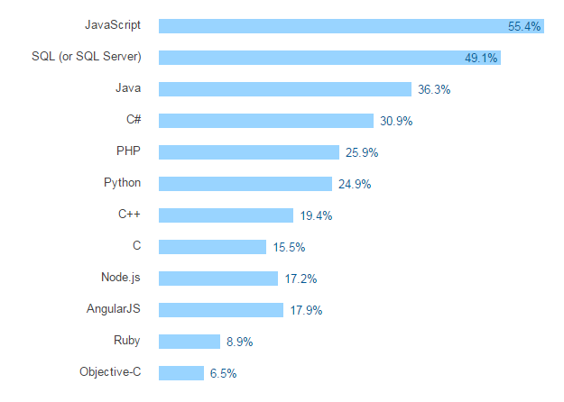

* TOC
{:toc}

# Notes préalables
Ce document écrit constitue le résultat de ma veille technologique menée dans le cadre du cours MSO 4.4.

Vous pouvez retrouvez les supports de la présentation orale [ici](https://stity.github.io/future-javascript/diaporama) ainsi qu'une [version pdf](https://stity.github.io/future-javascript/diaporama/presentation.pdf).


# Objectifs

A travers cette veille technologique, j'ai choisi de montrer quels sont les problèmes de ce langage et les solutions qui ont été mise en place ou qui vont l'être.

Cette présentation s'articule donc en trois partie. Je vais d'abord vous présenter JavaScript et ses caractéristiques, nous verrons ensemble les principals reproches qui lui sont généralement fait avant de mettre en avant les solutions existantes ou en cours de développement.

Ces solutions, comme nous le verrons au cours de ce document, peuvent émaner de plusieurs sources. Elles proviennent tantôt des évolutions des spécifications du langage et tantôt de la communauté, très active.

Il est à noter que les "reproches" présentés ici sont loins d'être exhaustifs et peuvent être subjectifs. Ils ne sont pas ceux de l'auteur de cet article mais ceux qui ont souvent été lus et entendus par l'auteur.

# Qu'est ce que JavaScript

## Présentation

JavaScript est un langage interprété à typage faible et dynamique. Décomposons ensemble la signification de cette phrase qui a son importance pour la suite de l'exposé.

- Interprété : par opposition aux langages compilés, le moteur JavaScript extrait directement du code source les instructions à éxécuter, on parle de compilation Just In Time [^1]
- Typage faible : le type d'une variable peut changer au cours de l'éxécution.
- Typage dynamique : le type d'une variable est déterminé au moment de l'attribution de sa valeur à la variable.

Inventé en 1987 par Tim Berners Lee, il est principalement connu pour être le langage du Web.

La dernière version stable de ses spécifications se nomme ECMAScript2016 et a été publié le 17 juin 2016. La version actuelle des spécification, encore en développement, est ECMAScript 2017.

[^1]: Pour plus d'informations sur la compilation Just In Time, je vous recommande [cet article "A cartoon Intro to WebAssembly"](https://hacks.mozilla.org/2017/02/a-cartoon-intro-to-webassembly/) par Lin Clark qui explique, en autres, le fonctionnement des compilateurs Just In Time et leur intéret

## Moteurs

La plupart des ordinateurs, tablettes et téléphones sont équipées d'un moteur JavaScript puisqu'il suffit d'un navigateur Web. Chaque navigateur possède son propre moteur :

- V8 pour Google Chrome
- Spider Monkey pour Mozilla Firefox
- Chakra pour Microsoft Edge (et Internet Explorer)
- JavaScript Core pour Safari

Mais il n'est pas nécessaire d'éxécuter JavaScript dans un navigateur; le framework [Node.js](https://nodejs.org) utilise le moteur V8 pour éxécuter JavaScript et permet l'éxecution de JavaScript sans navigateur. Ce framework est principalement utilisé côté serveur pour des applications Web.

## Un langage polyvalent

JavaScript est bien évidemment utilisé dans les pages Web mais pas seulement. On le retrouve également côté serveur avec Node.js, en application "Desktop" avec [Electron](http://electron.atom.io) (exemple d'application développée avec Electron : Bracket, le célèbre éditeur de texte orienté Web et développé par Adobe et Atom son concurrent développé par Github.)

Hello World version navigateur :

```javascript
document.body.innerHTML = "Hello World !";
```

Serveur Hello World avec Node.js :

```javascript
const http = require('http');

http.createServer( function(req, res) {
  res.writeHead(200, {'Content-Type': 'text/plain'});
  res.end("Hello World !\n");
});
server.listen(8080);

```


JavaScript est généralement décrit comme un langage multiparadigme : il peut être impératif, orienté objet (même les fonctions sont des objets en JavaScript), fonctionnel, ...

Ci-dessous un exempe de programmation impérative :
```javascript
var a = 1;
var b = 2;
var c = 1;

if (b*b - 4*a*c >= 0) {
    console.log("solution !");
}
```

Ci-dessous un exempe de programmation fonctionnelle :
```javascript
function square (a) {
    return a*a;
}
function isEven (a) {
    return (a % 2) == 0;
}
const evenSquares = [1,2,3,4,5,6].map(square).filter(isEven);

```

Ci-dessous un exempe de programmation orientée objet :
```javascript
function Personne(nom) {
  this.nom = nom;
  console.log('Nouvel objet Personne créé');
}

var personne1 = new Personne('Alice');
var personne2 = new Personne('Bob');

//on affiche le nom de personne1 
console.log('personne1 est ' + personne1.nom); // personne1 est Alice
console.log('personne2 est ' + personne2.nom); // personne2 est Bob
```


Ces différents exemples démontrent la simplicité et la polyvalence de JavaScript.

## Développement actif

Selon [W3techs](https://w3techs.com/technologies/details/cp-javascript/all/all), près de 94% des sites Web utilisent JavaScript. Le langage est [n°1 des tendances sur GitHub de 2013](https://github.com/blog/2047-language-trends-on-github). Pour rappel, GitHub est la plateforme principale de gestion de version pour les projets et notamment pour les projets OpenSource. Plus de [390 000 packages](http://www.modulecounts.com/) sont disponibles sur [NPM](http://www.npmjs.com) (Node Packages Manager), la plateforme de gestion des modules JavaScript. Chaque jour, près de 525 nouveaux packages rejoignent en moyenne la plateforme.

JavaScript est le langage le plus populaire (connu par les développeurs) et le plus discuté (en terme de nombre de tags) sur [StackOverflow](http://stackoverflow.com/research/developer-survey-2016#technology).




Les langages connus par les développeurs, sondage effectué en 2016 par StackOverflow.

Selon [HTTPArchive](http://httparchive.org/trends.php), la quantité moyenne de code JavaScript présent sur une page web s'élève à 420Ko et ce chiffre est en augmentation.


## Compatibilité

Le développement de JavaScript est constant. Des fonctionnalités sont sans cesse ajoutées aux spécifications. De ce fait, les moteurs peinent parfois à implémenter toutes les fonctionnalités et ils n'implémentent pas tous les mêmes.

Une table de compatibilité est [disponible en ligne](http://kangax.github.io/compat-table/es6/) et recensent les fonctionnalités implémentées par les moteurs et leurs différentes versions. Ci dessous, une capture d'écran de cette table pour ES6 :


## Polyfills

Il n'existe pas de numéro de version du langage JavaScript, c'est un parti pris. Le programme doit tester si une fonction est disponible avant de pouvoir l'utiliser.

Les polyfills permettent de redéfinir les fonctions manquantes. Ils sont notamment utiles pour garantir l'éxecution du code dans les navigateurs les plus anciens qui ne disposent pas des fonctionnalités les plus récentes.

Dans ce domaine, on peut citer [Babel](https://babeljs.io/) qui permet de transpiler du code JavaScript utilisant les dernières versions d'ECMAScript vers une version plus anciennes afin de pouvoir émuler les nouvelles fonctionnalités dans les navigateurs les plus anciens.

```javascript

let [a,b,c] = [1,2,3];

const carre = [1,2,3].map(x => x**2);

```

Ce code peut être transpiler en utilisant Babel et devient alors :
```javascript
"use strict";

var a = 1,
    b = 2,
    c = 3;


var carre = [1, 2, 3].map(function (x) {
  return Math.pow(x, 2);
});
let [a,b,c] = [1,2,3];

const carre = [1,2,3].map(x => x**2);

```

# Les reproches

Les reproches qui seront ici abordés sont les suivants :

- Pas de typage fort
- Callback Hell
- Mauvaise lisibilité
    - Callback Hell
    - Syntaxe étrange
- Pas de mémoire partagée
- Lenteur

## Typage

L'absence de typage fort rend le débuggage difficile, l'autocomplétion difficile pour les environnements de développement et l'éxécution plus lente.

Le débuggage est plus difficile car une même variable peut changer de type, des propriétés peuvent être ajoutées ou supprimer.
Pour ces mêmes raisons, l'autocomplétion peine à connaitre les méthodes ou propriétés d'un objet. 
L'éxécution est plus lente car le compilateur doit deviner le type d'un objet, si l'objet change de type ou s'il s'est trompé en devinant il perd du temps à réassigner l'objet.

## Les alternatives

Plusieurs alternatives ont été développées pour contrer ce problème de typage :

 - [Dart](http://www.dartlang.org) développé par Google
 - [TypeScript](http://www.typescriptlang.org/) popularisé par le framework Angular
 - [asm.js](http://asmjs.org/) 
 
### Dart

D'après le site du langage Dart : "Dart is an application programming language that’s easy to learn, easy to scale, and deployable everywhere."
Dart peut être utilisé dans un navigateur, en ligne de commande, sur des serveurs ou sur des mobiles.

Ci dessous un exemple de code Dart qui génère une approximation de pi par la méthode de Monte-Carlo.

```dart
import 'dart:async';
import 'dart:math' show Random;

main() async {
  print('Compute π using the Monte Carlo method.');
  await for (var estimate in computePi()) {
    print('π ≅ $estimate');
  }
}

/// Generates a stream of increasingly accurate estimates of π.
Stream<double> computePi({int batch: 1000000}) async* {
  var total = 0;
  var count = 0;
  while (true) {
    var points = generateRandom().take(batch);
    var inside = points.where((p) => p.isInsideUnitCircle);
    total += batch;
    count += inside.length;
    var ratio = count / total;
    // Area of a circle is A = π⋅r², therefore π = A/r².
    // So, when given random points with x ∈ <0,1>,
    // y ∈ <0,1>, the ratio of those inside a unit circle
    // should approach π / 4. Therefore, the value of π
    // should be:
    yield ratio * 4;
  }
}

Iterable<Point> generateRandom([int seed]) sync* {
  final random = new Random(seed);
  while (true) {
    yield new Point(random.nextDouble(), random.nextDouble());
  }
}

class Point {
  final double x, y;
  const Point(this.x, this.y);
  bool get isInsideUnitCircle => x * x + y * y <= 1;
}
```

### TypeScript

```javascript
class Greeter {
    constructor(public greeting: string) { }
    greet() {
        return "<h1>" + this.greeting + "</h1>";
    }
};

var greeter = new Greeter("Hello, world!");

document.body.innerHTML = greeter.greet();
```

### asm.js

asm.js est un sous-ensemble de JavaScript. Les variables sont annotées pour aider le compilateur.

```javascript
function compiledCalculation() {
    var x = f()|0;  // x is a 32-bit value
    var y = g()|0;  // so is y
    return (x+y)|0; // 32-bit addition, no type or overflow checks
  }
```

## Callback Hell

Couramment décrié par les réfractaires à JavaScript, le Callback Hell est un syndrome qui consiste à chaîner les appels de callback en embriquant les fonctions les unes à l'intérieur des autres.
Cette pratique rend le code difficile à lire et empêche la bonne compréhension de ce qu'il se passe réellement, i.e. des appels asynchrones qui s'enchainent.


```javascript
function foo(finalCallback) {
  request.get(url1, function(err1, res1) {
    if (err1) { return finalCallback(err1); }
    request.post(url2, function(err2, res2) {
      if (err2) { return finalCallback(err2); }
      request.put(url3, function(err3, res3) {
        if (err3) { return finalCallback(err3); }
        request.del(url4, function(err4, res4) {
          // let's stop here
          if (err4) { return finalCallback(err4); }
          finalCallback(null, "whew all done");
        })
      })
    })
  })
```

### Promises (ES6)

Les promises ont été crées pour contrer cette structure.
L'usage du mot clé "then" a été choisi pour refléter le caractère asynchrone.
D'abord implémentés par la communauté, elles ont rejoint le standard ECMAScript6.


```javascript
function foo() {
  return request.getAsync(url1)
  .then(function(res1) {
    return request.postAsync(url2);
  }).then(function(res2) {
    return request.putAsync(url3);
  }).then(function(res3) {
     return request.delAsync(url4);
  }).then(function(res4) {
     return "whew all done";
  });
}
```

Le code est nettement plus lisible mais cependant il est tout de même nécessaire de créer des fonctions callback.

### Async/Await (ES7)

Afin d'éliminer complétement la nécessité des callbacks, ECMAScript7 introduit les mots clés async et await qui permettent d'éxécuter du code asynchrone de manière non bloquante tout en restant lisible.

```javascript
async function foo() {
  var res1 = await request.getAsync(url1);
  var res2 = await request.getAsync(url2);
  var res3 = await request.getAsync(url3);
  var res4 = await request.getAsync(url4);
  return "whew all done";
}
```

## Syntaxe

JavaScript possède certaines spécificités qui lui sont souvent reprochées :
 - l'héritage par prototypage
 - la portée des variables
 - la pollution de l'espace principal

### Classes

En JavaScript, les classes obtiennent leurs méthodes via l'objet prototype :

```javascript
function MyObjectA () {}
MyObjectA.prototype = {
  myMethod: function () {
    console.log("hello");
  }
};

var obj = new MyObjectA();
```

On remarquera également l'absence du mot clé class ce qui peut être déconcertant.

En copiant l'objet prototype, il est ainsi possible de créer un héritage entre classes mais cette méthode n'est pas intuitive pour ceux qui sont habitués aux langages tels que Java ou C++.

Pour toutes ces raisons, ES6 introduit le sucre syntaxique de classes :

```javascript
class MyObjectC {
  myMethod () {
    console.log("hello");
  }
}
var obj = new MyObjectC();
```

Ces deux codes sont identiquement interprétés par les moteurs récents.

Chacun est ainsi libre de choisir la syntaxe qui lui plait le plus.

### Portée des variables

```javascript
function fn() {
  let foo = "bar";
  var foo2 = "bar";
  if (true) {
    let foo; // pas d'erreur, foo === undefined
    var foo2; // foo2 est en réalité écrasé !
    foo = "qux";
    foo2 = "qux";
    console.log(foo); // "qux"
    console.log(foo2); // "qux"
  }
  console.log(foo);// "bar"
  console.log(foo2); // "qux"
}
```


### Modules

Avant les modules :

```html 
<script src="lib1.js"></scrip> <!--importe la fonction render -->
<script src="lib2.js"></script> <!--importe également une fonction render ce qui écrase la première librairie silencieusement-->
```

Avec les modules, chaque script importe les ressources nécéssaire avec le nom voulu ce qui évite les conflits de noms et met en valeur les dépendances requises.

Syntaxe Node.js et Browserify :
```javascript
const myModule = require("./my-module.js");
```

Syntaxe Webpack :
```javascript
import bar from './bar';
```

Node.js a popularisé l'utilisation des modules en JavaScript. Des librairies comme Browserify et Webpack permettent de propager l'utilisation des modules aux navigateurs.


## Parallélisme

JavaScript est généralement décrit comme un langage single threaded. Mais cette affirmation est de moins en moins vrai comme nous allons le voir avec la démocratisation des Web Workers, l'utilisation du GPU comme unité de calcul, et les évolutions à venir en termes de mémoire partagée.

### Web Worker

Un Web Worker est un programme s'éxécutant en parallèle dans un environnement indépendant. La communication et le thread principal se fait par un système de messages. Les données sont envoyées par copies ou "transférées".

La copie de données peut s'avérer couteuse en temps si la taille des données est importante.

Le transfert d'une variable est instantanné mais lorsqu'une variable est transférée elle n'est plus disponible dans le thread principal. Elle est emprunté.


### GPU

Il existe plusieurs manière de mettre à profit le GPU depuis JavaScript.
La plus connue consiste à employer WebGL pour des calculs graphiques. Il est cependant possible d'employer cette unité dédié au parallélisme pour des calculs plus "traditionnels" en codant directement des shaders ou via des librairies intermédiaires spécialisées comme [Turbo.js](https://turbo.github.io/)

Ci-dessous, un exemple de mis en oeuvre de Turbo.js.
```javascript
// Test if turbo.js is available 
if (turbojs) { 
  // Allocate a float-array of size 1,000,000 
  var blah = turbojs.alloc(1e6); 
  
  // Initialize data 
  for (i = 0; i <= 1e6; i++) blah.data[i] = i; 
  
  // [0, 1, 2, 3, 4] 
  console.log(blah.data.subarray(0, 5)); 
  
  // A simple kernel that calculates input *= 4 
  // for all 1e6 floats in parallel 
  turbojs.run(blah, `void main(void) { 
    commit(read() * 4.); 
  }`); 
  
  // [0, 4, 8, 12, 16] 
  console.log(blah.data.subarray(0, 5)); 
   
  // That's it :-) 
} 

```

### SharedArrayBuffer

L'implémentation récente des SharedArrayBuffer signe l'apparition de la mémoire partagée entre Web Workers.


```javascript
   // main.js

    const worker = new Worker('worker.js');

    // To be shared
    const sharedBuffer = new SharedArrayBuffer( // (A)
        10 * Int32Array.BYTES_PER_ELEMENT); // 10 elements

    // Share sharedBuffer with the worker
    worker.postMessage({sharedBuffer}); // clone

    // Local only
    const sharedArray = new Int32Array(sharedBuffer); // (B)
```

Pour cette fonctionalité est à l'essai dans les dernières versions des navigateurs majeurs et elle doit être activé via l'utilisation de flags.

### Atomics

Pour éviter les problèmes d'accès concurrents en lecture ou en écriture avec les SharedArrayBuffer, les Atomics ont été créés.
Il s'agit d'opérations atomiques qui s'assurent que des valeurs correctes sont écrites et lues, que les opérations sont finies avant que la suivante commence et que les opérations ne sont pas interrompues.

```javascript
// Initialization before sharing the Array
    Atomics.store(sharedArray, 0, 1);

    // main.js
    Atomics.store(sharedArray, 0, 2);

    // worker.js
    while (Atomics.load(sharedArray, 0) === 1) ;
    console.log(Atomics.load(sharedArray, 0)); // 2
```

### Performances des Web Workers


D'après l'article [ES proposal: Shared memory and atomics](http://www.2ality.com/2017/01/shared-array-buffer.html), les gains de performances sont linéaires avec le nombre de web worker jusqu'à 4 workers avec l'algorithme testé. Au delà les performances s'améliorent plus modestement.

## Optimisation et vitesse

A cause de sa nature, JavaScript peut s'avérer lent à l'éxécution. Même si l'utilisation des compilateurs Just In Time [^1] a permis un énorme gain de performance, il y a encore matière à mieux.
Pour cela, le code doit être plus proche du code éxécuté par la machine.

### asm.js

asm.js est un sous ensemble très restraint de JavaScript. Il ne contient notamment pas d'objets. L'anotation des variables permet d'éviter le typage dynamique ce qui permet in fine de réaliser des optimisations de bas niveau.
La compilation d'asm.js s'approche donc plus d'une compilation Ahead-Of-Time que d'une compilation Just-In-Time.

Il est ainsi possible de convertir du code C++ en asm.js, notamment grâce à [EMScripten](http://kripken.github.io/emscripten-site/)
```javascript
function compiledCalculation() {
    var x = f()|0;  // x is a 32-bit value
    var y = g()|0;  // so is y
    return (x+y)|0; // 32-bit addition, no type or overflow checks
  }
```


Comme on peut le voir sur le graphique ci-dessus, l'utilisation d'asm.js permet d'avoir des performances à peine deux fois moins bonnes qu'avec un langage comme C++.

### Web Assembly

Web Assembly est l'équivalent binaire d'asm.js. Le taille du code est ainsi réduite ce qui diminue le temps de chargement et le temps de parsing.

Le JavaScript exécuté de manière classique partage le même espace sémantique que Web Assembly pour permettre les appels entre ces deux technologies. Cela est notamment nécessaire pour pouvoir accéder au DOM, en effet il n'est pas possible d'accéder au DOM depuis Web Assembly.

En termes de performances, Web Assembly affiche un temps de parsing jusqu'à 20 fois meilleur et un temps de chargement 1,5 à 3 fois meilleur.

# Conclusion

JavaScript des avantages incontestables : déjà son omniprésence aussi bien pour le développement web, le développement d'applications mobies et serveurs, puis sa simplicité d'apprentissage et enfin son évolution très rapide menée par une communauté nombreuse et motivée qui permet de s'adapter aux exigences toujours plus accrues de l'industrie et du public en terme de performance et de fonctionnalités.

Tous ces avantages en font indéniablement un langage d'avenir.