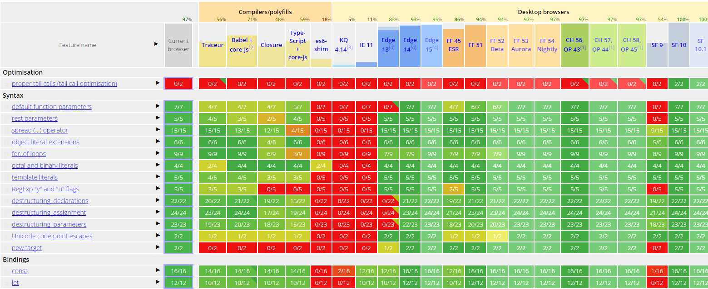

* TOC
{:toc}

# Notes préalables
Ce document écrit constitue le résultat de ma veille technologique menée dans le cadre du cours MSO 4.4.

Vous pouvez retrouvez les supports de la présentation orale [ici](https://stity.github.io/future-javascript/diaporama) ainsi qu'une [version pdf](https://stity.github.io/future-javascript/diaporama/presentation.pdf).


# Objectifs

A travers cette veille technologique, j'ai choisi de montrer quels sont les problèmes de ce langage et les solutions qui ont été mise en place ou qui vont l'être.

Cette présentation s'articule donc en trois partie. Je vais d'abord vous présenter JavaScript et ses caractéristiques, nous verrons ensemble les principals reproches qui lui sont généralement fait avant de mettre en avant les solutions existantes ou en cours de développement.

Ces solutions, comme nous le verrons au cours de ce document, peuvent émaner de plusieurs sources. Elles proviennent tantôt des évolutions des spécifications du langage et tantôt de la communauté, très active.

Il est à noter que les "reproches" présentés ici sont loins d'être exhaustifs et peuvent être subjectifs. Ils ne sont pas ceux de l'auteur de cet article mais ceux qui ont souvent été lus et entendus par l'auteur.

# Qu'est ce que JavaScript

## Présentation

JavaScript est un langage interprété à typage faible et dynamique. Décomposons ensemble la signification de cette phrase qui a son importance pour la suite de l'exposé.

- Interprété : par opposition aux langages compilés, le moteur JavaScript extrait directement du code source les instructions à éxécuter, on parle de compilation Just In Time TODOTODOTODOTODO : compléter
- Typage faible : le type d'une variable peut changer au cours de l'éxécution.
- Typage dynamique : le type d'une variable est déterminé au moment de l'attribution de sa valeur à la variable.

Inventé en 1987 par Tim Berners Lee, il est principalement connu pour être le langage du Web.

La dernière version stable de ses spécifications se nomme ECMAScript2016 et a été publié le 17 juin 2016. La version actuelle des spécification, encore en développement, est ECMAScript 2017.

## Moteurs

La plupart des ordinateurs, tablettes et téléphones sont équipées d'un moteur JavaScript puisqu'il suffit d'un navigateur Web. Chaque navigateur possède son propre moteur :

- V8 pour Google Chrome
- Spider Monkey pour Mozilla Firefox
- Chakra pour Microsoft Edge (et Internet Explorer)
- JavaScript Core pour Safari

Mais il n'est pas nécessaire d'éxécuter JavaScript dans un navigateur; le framework [Node.js](https://nodejs.org) utilise le moteur V8 pour éxécuter JavaScript et permet l'éxecution de JavaScript sans navigateur. Ce framework est principalement utilisé côté serveur pour des applications Web.

## Un langage polyvalent

JavaScript est bien évidemment utilisé dans les pages Web mais pas seulement. On le retrouve également côté serveur avec Node.js, en application "Desktop" avec [Electron](http://electron.atom.io) (exemple d'application développée avec Electron : Bracket, le célèbre éditeur de texte orienté Web et développé par Adobe et Atom son concurrent développé par Github.)

Hello World version navigateur :

```javascript
document.body.innerHTML = "Hello World !";
```

Serveur Hello World avec Node.js :

```javascript
const http = require('http');

http.createServer( function(req, res) {
  res.writeHead(200, {'Content-Type': 'text/plain'});
  res.end("Hello World !\n");
});
server.listen(8080);

```


JavaScript est généralement décrit comme un langage multiparadigme : il peut être impératif, orienté objet (même les fonctions sont des objets en JavaScript), fonctionnel, ...
```javascript
// exemple impératif
```
```javascript
// exemple fonctionnel
```
```javascript
// exemple Orienté Objet
```


Ces différents exemples démontrent la simplicité et la polyvalence de JavaScript.

## Développement actif

Selon [W3techs](https://w3techs.com/technologies/details/cp-javascript/all/all), près de 94% des sites Web utilisent JavaScript. Le langage est [n°1 des tendances sur GitHub de 2013](https://github.com/blog/2047-language-trends-on-github). Pour rappel, GitHub est la plateforme principale de gestion de version pour les projets et notamment pour les projets OpenSource. Plus de [390 000 packages](http://www.modulecounts.com/) sont disponibles sur [NPM](http://www.npmjs.com) (Node Packages Manager), la plateforme de gestion des modules JavaScript. Chaque jour, près de 525 nouveaux packages rejoignent en moyenne la plateforme.

JavaScript est le langage le plus populaire (connu par les développeurs) et le plus discuté (en terme de nombre de tags) sur [StackOverflow](http://stackoverflow.com/research/developer-survey-2016#technology).


Les langages connus par les développeurs, sondage effectué en 2016 par StackOverflow.

Selon [HTTPArchive](http://httparchive.org/trends.php), la quantité moyenne de code JavaScript présent sur une page web s'élève à 420Ko et ce chiffre est en augmentation.


## Compatibilité

Le développement de JavaScript est constant. Des fonctionnalités sont sans cesse ajoutées aux spécifications. De ce fait, les moteurs peinent parfois à implémenter toutes les fonctionnalités et ils n'implémentent pas tous les mêmes.

Une table de compatibilité est [disponible en ligne](http://kangax.github.io/compat-table/es6/) et recensent les fonctionnalités implémentées par les moteurs et leurs différentes versions. Ci dessous, une capture d'écran de cette table pour ES6 :


## Polyfills

Il n'existe pas de numéro de version du langage JavaScript, c'est un parti pris. Le programme doit tester si une fonction est disponible avant de pouvoir l'utiliser.

Les polyfills permettent de redéfinir les fonctions manquantes. Ils sont notamment utiles pour garantir l'éxecution du code dans les navigateurs les plus anciens qui ne disposent pas des fonctionnalités les plus récentes.

Dans ce domaine, on peut citer [Babel](https://babeljs.io/) qui permet de transpiler du code JavaScript utilisant les dernières versions d'ECMAScript vers une version plus anciennes afin de pouvoir émuler les nouvelles fonctionnalités dans les navigateurs les plus anciens.

```javascript

exemple Babel

```

# Les reproches

Les reproches qui seront ici abordés sont les suivants :

- Pas de typage fort
- Callback Hell
- Mauvaise lisibilité
    - Callback Hell
    - Syntaxe étrange
- Pas de mémoire partagée
- Lenteur

## Typage

L'absence de typage fort rend le débuggage difficile, l'autocomplétion difficile pour les environnements de développement et l'éxécution plus lente.
